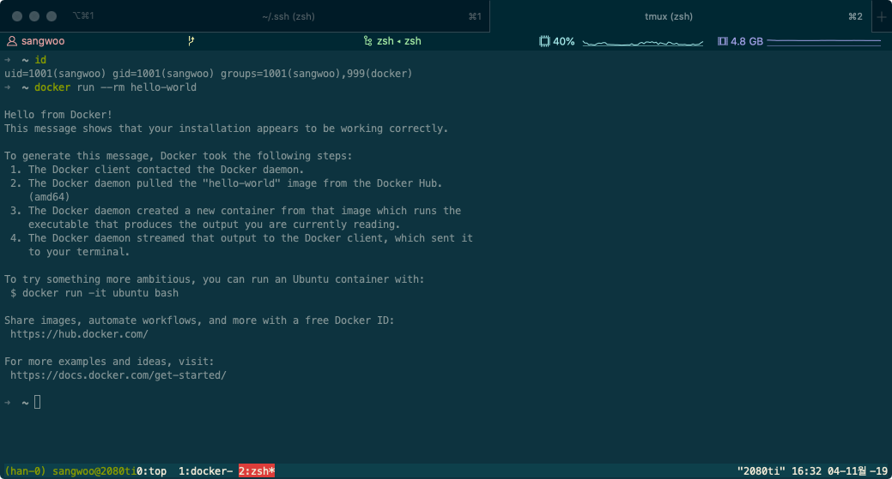
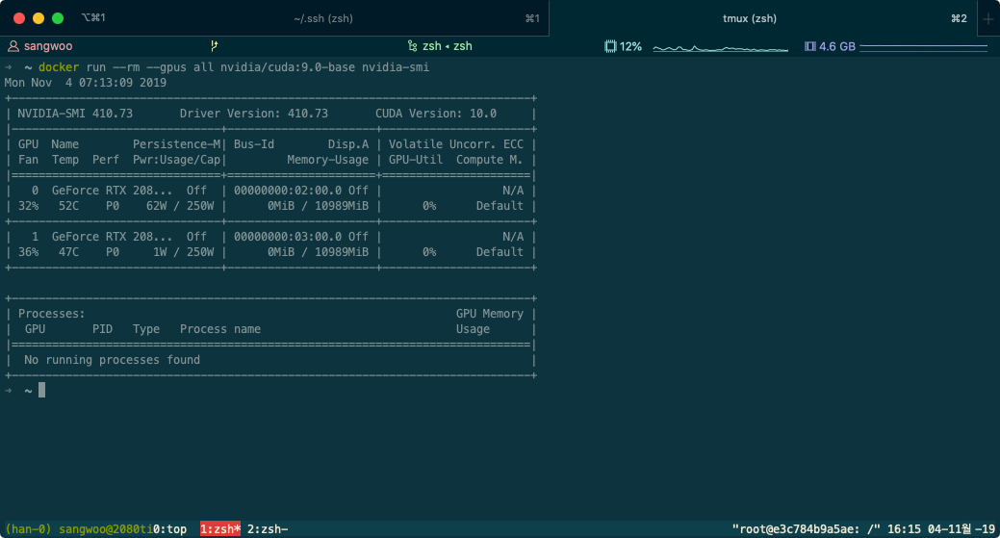
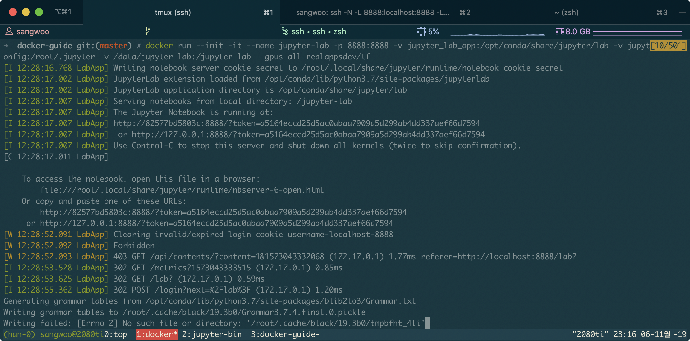
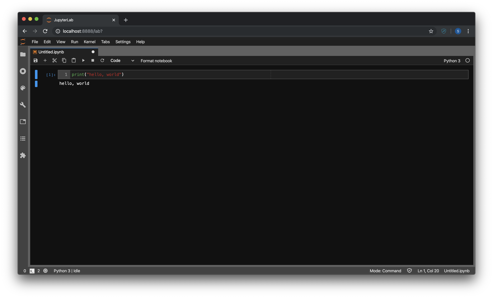

# Docker 가이드 (설치)

사용법은 [여기](https://github.com/uoo723/docker-guide/blob/master/tutorial/tutorial.md)

## 설치

### 1. `apt` 패키지 인덱스 업데이트

```sh
$ sudo apt-get update
```

### 2. HTTPS를 통해 `apt`가 외부 repository를 사용할 수 있게 하기 위해 필요한 패키지 설치

```sh
$ sudo apt-get install \
    apt-transport-https \
    ca-certificates \
    curl \
    gnupg-agent \
    software-properties-common
```

### 3. Docker official GPG key 추가

```sh
curl -fsSL https://download.docker.com/linux/ubuntu/gpg | sudo apt-key add -
```

### 4. stable 버전 repository 추가

```sh
$ sudo add-apt-repository \
"deb [arch=amd64] https://download.docker.com/linux/ubuntu \
$(lsb_release -cs) \
stable"
```

### 5. `apt` 패키지 인덱스 업데이트

```sh
$ sudo apt-get update
```

### 6. 최신 버전 Docker 설치

```sh
$ sudo apt-get install docker-ce docker-ce-cli containerd.io
```

### 7. docker 그룹 추가 (Optional, 권장)

docker command는 root 권한을 요구하므로 매번 docker command를 입력하려면 sudo 명령으로
실행해야 함. 이를 완화하기 위해 docker command를 사용하는 user를 docker 그룹에 포함시켜 sudo
명령을 생략할 수 있게 함. (이후 설명할 docker command는 sudo 명령어를 생략함.)

```sh
$ sudo usermod -aG docker [your-user]
```

실행 후 logout한 다음 (shell에서 exit) 다시 로그인 하여 확인  
tmux와 같은 terminal multiplexer를 사용한다면 모든 session을 종료해야 함.

```sh
$ id # uid 및 gid 확인
$ docker run --rm hello-world # test run 정상적으로 실행되는지 확인
```



### 8. docker-compose 설치하기  

`docker-compose`는 [multi-container](#Docker\ 용어\ 설명) Docker application을 정의하고
실행하는 툴인데 단일 container를 실행하고 관리하기에도 매우 유용하다.

```sh
$ sudo curl -L "https://github.com/docker/compose/releases/download/1.24.1/docker-compose-$(uname -s)-$(uname -m)" -o /usr/local/bin/docker-compose # docker-compose 다운로드
$ sudo chmod +x /usr/local/bin/docker-compose # 실행권한 부여
$ docker-compose --version # 버전 확인
```

#### Update

- 2019-11-04  
  현재 최신 docker compose file version (v 3.7)에서 `gpus` flag가 지원하지 않아 docker-compose 활용을 보류함.

### 9. [NVIDIA Container Toolkit](https://github.com/NVIDIA/nvidia-docker) 설치  

GPU 자원을 Docker Container에서 사용하기 위해서는 NVIDIA Container
Toolkit을 설치하여야 한다.

#### Prerequisite

- Ubuntu 16.04/18.04, Debian Jessie/Stretch/Buster
- Docker >= 19.03
- [NVIDIA Driver](https://github.com/NVIDIA/nvidia-docker/wiki/Frequently-Asked-Questions#how-do-i-install-the-nvidia-driver)

```sh
$ distribution=$(. /etc/os-release;echo $ID$VERSION_ID)
$ curl -s -L https://nvidia.github.io/nvidia-docker/gpgkey | sudo apt-key add -
$ curl -s -L https://nvidia.github.io/nvidia-docker/$distribution/nvidia-docker.list | sudo tee /etc/apt/sources.list.d/nvidia-docker.list
$ sudo apt-get update && sudo apt-get install -y nvidia-container-toolkit
$ sudo systemctl restart docker
```

#### Test

```sh
$ docker run --rm --gpus all nvidia/cuda:9.0-base nvidia-smi
```



### 10. Dockerfile 작성하기

Docker를 사용하여 원하는 개발환경을 구축하기 위해서는 Docker Hub와 같은 open repository에서 
미리 빌드된 이미지를 사용하거나 사용자가 직접 이미지를 빌드해야 한다. Official 이미지를
사용하면 미리 세팅된 환경을 구축할 수 있지만 customizing이 다소 힘들다. 따라서 여기서는
Dockerfile를 작성해 직접 이미지를 빌드하여 입맛에 맞게 환경을 셋팅하는 방법을 알아 볼 것이다.
구축할 환경은 다음과 같다.

* Ubuntu 18.04
* cuda 10.0
* cudnn 7.6
* Anaconda3 (python3.7)
* tensorflow 2.0 (Dockerfile를 수정하여 pytorch를 설치할 수 있음)
* jupyter lab (jupyter  notebook의 확장 버전)

#### Dockerfile

```Dockerfile
# cuda 및 cudnn이 미리 세팅된 official image 가져오기
FROM nvidia/cuda:10.0-cudnn7-devel-ubuntu18.04

# 생성될 container의 환경변수 설정
ENV LANG=C.UTF-8 LC_ALL=C.UTF-8
ENV PATH /opt/conda/bin:$PATH

# apt repository 업데이트 및 필요한 패키지 설치
RUN apt-get update --fix-missing && apt-get install -y wget bzip2 ca-certificates \
    libglib2.0-0 libxext6 libsm6 libxrender1 \
    git mercurial subversion && \
    apt-get clean && \
    rm -rf /var/lib/apt/lists/*

# Anaconda3 설치
RUN wget --quiet https://repo.anaconda.com/archive/Anaconda3-2019.10-Linux-x86_64.sh -O ~/anaconda.sh && \
    /bin/bash ~/anaconda.sh -b -p /opt/conda && \
    rm ~/anaconda.sh && \
    ln -s /opt/conda/etc/profile.d/conda.sh /etc/profile.d/conda.sh && \
    echo ". /opt/conda/etc/profile.d/conda.sh" >> ~/.bashrc && \
    echo "conda activate base" >> ~/.bashrc && \
    cp ~/.bashrc /etc/bash.bashrc && \
    chmod 777 /etc/bash.bashrc

# Jupyter lab workspace 생성
RUN mkdir -p /jupyter-lab && chmod 777 /jupyter-lab

# conda 패키지 설치
RUN conda update -y conda && \
    conda install -y tensorflow-gpu=2.0.0 nodejs black && \
    conda update -y jupyterlab && \
    conda clean -y -a

# volume mount 지정
VOLUME ["/opt/conda/share/jupyter/lab", "/root/.jupyter", "/jupyter-lab"]

# working directory 지정
WORKDIR /jupyter-lab

# 8888 포트 사용
EXPOSE 8888

# container 실행시 entrypoint command
ENTRYPOINT ["/bin/bash", "-c", "source /etc/bash.bashrc && jupyter lab --ip 0.0.0.0 --no-browser --allow-root"]
```

#### Image 빌드하기

```sh
$ docker build -t [태그이름] .  # Dockerfile이 위치한 디렉토리에서
```

태그이름 형식: [repository name]/[image name]:[tag]  
e.g. realappsdev/tf:latest

#### 빌드된 이미지 확인

```sh
$ docker images

REPOSITORY          TAG                             IMAGE ID            CREATED             SIZE
realappsdev/tf      latest                          9eb19b0a20b2        4 hours ago         9.07GB
nvidia/cuda         10.0-cudnn7-devel-ubuntu18.04   eaf2ceb9de1a        2 months ago        3.08GB
hello-world         latest                          fce289e99eb9        10 months ago       1.84kB
```

#### 컨테이너 실행

```sh
$ docker run --init \  # 컨테이너에 init 실행
    -it \  # interactive & pseudo-tty
    --name jupyter-lab \  # 컨테이너 이름 지정
    -p 8888:8888 \  # 포트 개방
    -v jupyter_lab_app:/opt/conda/share/jupyter/lab \  # named volume
    -v jupyter_lab_config:/root/.jupyter \  # named volume
    -v /data/jupyter-lab:/jupyter-lab \  # bind host filesystem
    --gpus all \  # gpu 리소스 사용
    realappsdev/tf  # 이미지 이름
```

host 머신에 /data/jupyter-lab 디렉토리가 존재해야 함. (또는 다른 디렉토리로 지정 가능)



#### Jupyter lab 접속

http://[server-ip]:8888  



## Docker 용어 설명

공식적인 설명은 다음 링크 참고.  
[Docker Glossary](https://docs.docker.com/glossary/)

| Term              | Definition                                                  |
| ----------------- | :---------------------------------------------------------- |
| Image             | 가상머신에서 사용되는 스냅샷과 비슷한 개념.                                    |
| Container         | Image의 runtime 인스턴스. java에 비유하면 image는 class, conatiner는 객체 |
