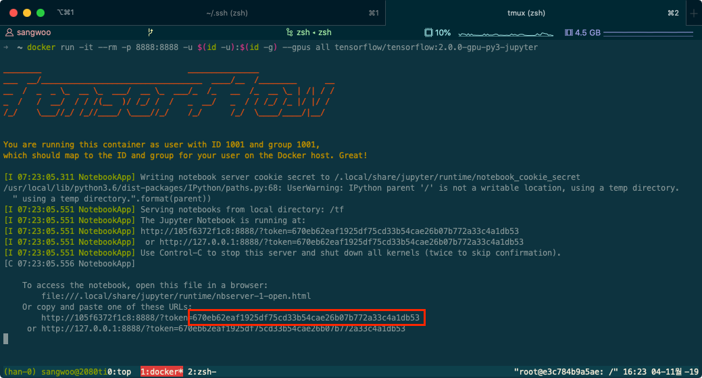
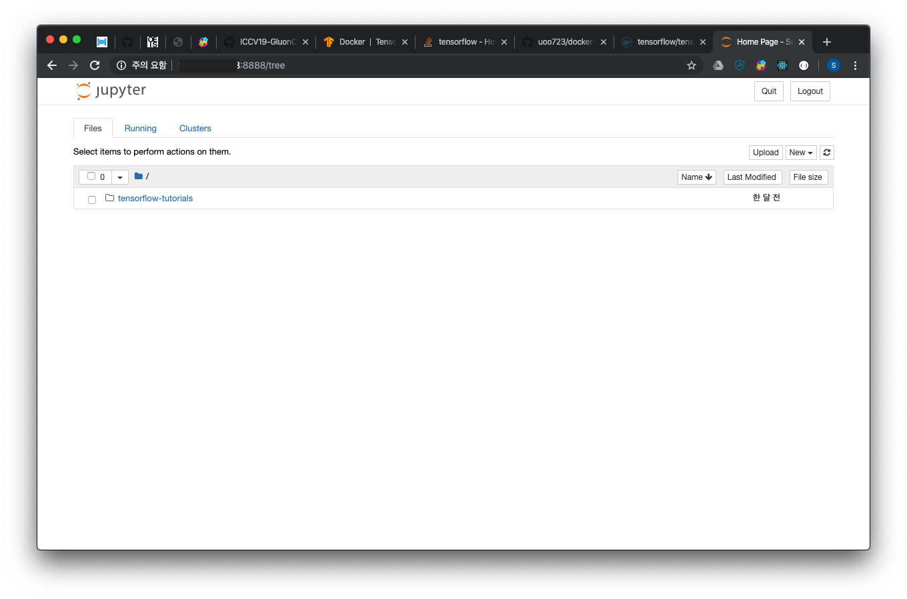
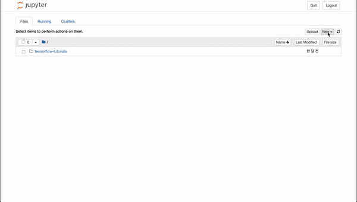

# Docker 가이드

## 설치

### 1. `apt` 패키지 인덱스 업데이트

```sh
$ sudo apt-get update
```

### 2. HTTPS를 통해 `apt`가 외부 repository를 사용할 수 있게 하기 위해 필요한 패키지 설치

```sh
$ sudo apt-get install \
    apt-transport-https \
    ca-certificates \
    curl \
    gnupg-agent \
    software-properties-common
```

### 3. Docker official GPG key 추가

```sh
curl -fsSL https://download.docker.com/linux/ubuntu/gpg | sudo apt-key add -
```

### 4. stable 버전 repository 추가

```sh
$ sudo add-apt-repository \
"deb [arch=amd64] https://download.docker.com/linux/ubuntu \
$(lsb_release -cs) \
stable"
```

### 5. `apt` 패키지 인덱스 업데이트

```sh
$ sudo apt-get update
```

### 6. 최선 버전 Docker 설치

```sh
$ sudo apt-get install docker-ce docker-ce-cli containerd.io
```

### 7. docker 그룹 추가 (Optional)  

docker command는 root 권한을 요구하므로 매번 docker command를 입력하려면 sudo 명령으로
실행해야 함. 이를 완화하기 위해 docker command를 사용하는 user를 docker 그룹에 포함시켜 sudo
명령을 생략할 수 있게 함. (이후 설명할 docker command는 sudo 명령어를 생략함.)

```sh
$ sudo usermod -aG docker [your-user]
```

실행 후 logout한 다음 (shell에서 exit) 다시 로그인 하여 확인  
tmux와 같은 terminal multiplexer를 사용한다면 모든 session을 종료해야 함.

```sh
$ id # uid 및 gid 확인
$ docker run --rm hello-world # test run 정상적으로 실행되는지 확인
```


### 8. docker-compose 설치하기  

`docker-compose`는 [multi-container](#Container) Docker application을 정의하고
실행하는 툴인데 단일 [container](#Container)를 실행하고 관리하기에도 매우 유용하다.
사용법은 [docker-compose](#docker-compose) section에서 다루도록 한다. 

```sh
$ sudo curl -L "https://github.com/docker/compose/releases/download/1.24.1/docker-compose-$(uname -s)-$(uname -m)" -o /usr/local/bin/docker-compose # docker-compose 다운로드
$ sudo chmod +x /usr/local/bin/docker-compose # 실행권한 부여
$ docker-compose --version # 버전 확인
```

### 9. [NVIDIA Container Toolkit](https://github.com/NVIDIA/nvidia-docker) 설치  
GPU 자원을 Docker [Container](#Container)에서 사용하기 위해서는 NVIDIA Container
Toolkit을 설치하여야 한다.

#### Prerequisite

- Ubuntu 16.04/18.04, Debian Jessie/Stretch/Buster
- Docker >= 19.03
- [NVIDIA Driver](https://github.com/NVIDIA/nvidia-docker/wiki/Frequently-Asked-Questions#how-do-i-install-the-nvidia-driver)

```sh
$ distribution=$(. /etc/os-release;echo $ID$VERSION_ID)
$ curl -s -L https://nvidia.github.io/nvidia-docker/gpgkey | sudo apt-key add -
$ curl -s -L https://nvidia.github.io/nvidia-docker/$distribution/nvidia-docker.list | sudo tee /etc/apt/sources.list.d/nvidia-docker.list
$ sudo apt-get update && sudo apt-get install -y nvidia-container-toolkit
$ sudo systemctl restart docker
```

#### Test

```sh
$ docker run --rm --gpus all nvidia/cuda:9.0-base nvidia-smi
```


### 10. GPU-Accelerated Tensorflow 및 Jupyter Notebook을 Container에서 실행해보기

#### 실행

```sh
$ docker run \
    -it \ # container와 상호작용하기 위한 옵션 (키보드 입력)
    --rm \ # container 프로세스가 exit하면 자동으로 container을 삭제
    -p 8888:8888 \ # host와 container의 포트 mapping
    -u $(id -u):$(id -g) \ # host의 유저 id와 그룹 id로 container 실행
    --gpus all \ # 모든 gpu 리소스 사용
    tensorflow/tensorflow:2.0.0-gpu-py3-jupyter # 사용할 docker image
```



#### 접속하기

http://[server ip]:8888/?token=[token]



#### 테스트

<p align="center">
    
</p>

## Docker 용어 설명

### Image

TODO

### Container

TODO

## Docker 기본 명령

TODO

## docker-compose

TODO
